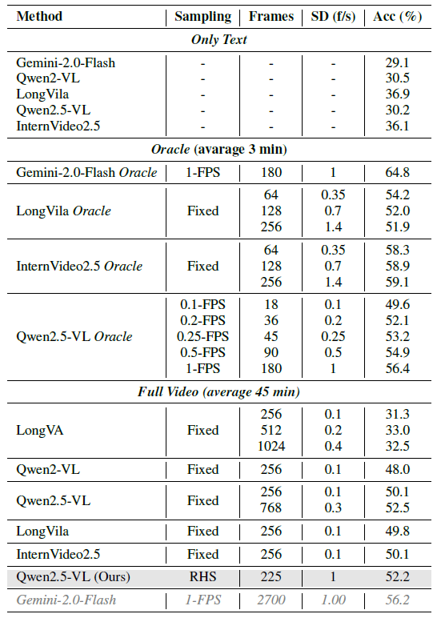

# LSDBench: Long-video Sampling Dilemma Benchmark


A benchmark that focuses on the sampling dilemma in long-video tasks. Through well-designed tasks, it evaluates the sampling efficiency of long-video VLMs.

Arxiv Paper: [📖 Does Your Vision-Language Model Get Lost in the Long Video Sampling Dilemma?](https://arxiv.org/abs/2503.12496)   
Huggingface: [🤗 LSDBench](https://huggingface.co/datasets/TainU/LSDBench)

## Sampling Dilemma

<div align=center>

</div>

***(Left)** In Q1, identifying a camera wearer's visited locations requires analyzing the entire video. However, key frames are sparse, so sampling one frame per minute often provides enough information. In contrast, Q2 examines the packing order during checkout, requiring high-resolution sampling to capture rapid actions. **(Right)** **Sampling Dilemma** emerges in tasks like Q2: a low sampling density fails to provide sufficient visual cues for accurate answers, while a high sampling density results in redundant frames, significantly slowing inference speed. This challenge underscores the need for adaptive sampling strategies, especially for tasks with high necessary sampling density.*

## Contents

- [Introduction](#introduction)
- [Key Features](#key-features)
- [LSDBench](#lsdbench)
- [Evaluation](#evaluation-on-lsdbench)
- [Results](#results)
- [Citation](#citation)


## Introduction

Large Vision-Language Models (LVLMs) have shown impressive capabilities in video understanding. However, processing long videos efficiently remains a challenge due to the "Sampling Dilemma": low-density sampling risks missing critical information, while high-density sampling introduces redundancy. Our work introduces **LSDBench**, a novel benchmark designed to evaluate LVLMs on long-video tasks by constructing high Necessary Sampling Density (NSD, the minimum sampling density required to accurately answer a given question) questions. We also provide the code for our proposed training-free **Reasoning-Driven Hierarchical Sampling (RHS)** framework and **Semantic-Guided Frame Selector (SGFS)** to address this dilemma.

## Key Features

<div align=center>

<figcaption>

</figcaption>
</div>

_**The line graph illustrates the relationship between
the number of sampled frames (x-axis) and accuracy on LSD-
Bench (y-axis).** We conduct experiments on two settings: **Oracle** and **Full Video**. The Oracle setting involves using the annotated target segment as the video input, while the Full Video setting provides the complete long video as input. Solid lines represent results under the Full Video setting, while dashed lines with inverted triangles correspond to the Oracle setting. The gap between the Oracle and global uniform sampling highlights the potential for improved sampling strategies in long-video VLMs._

  

*   **LSDBench Dataset:** A benchmark with questions characterized by high Necessary Sampling Density (NSD) requirements and videos lasting for hours.  Focuses on dense action sequences within short segments of long videos.
*   **Reasoning-Driven Hierarchical Sampling (RHS):** A two-stage framework that improves long-video processing efficiency by focusing the VLM on important segments.
*   **Semantic-Guided Frame Selector (SGFS):** A lightweight module that selects frames with higher visual information content without any question prior.

## LSDBench


The LSDBench dataset is designed to evaluate the sampling efficiency of long-video VLMs. It consists of multiple-choice question-answer pairs based on hour-long videos, focusing on short-duration actions with high Necessary Sampling Density (NSD).

*   **Number of QA Pairs:** 1304
*   **Number of Videos:** 400
*   **Average Video Length:** 45.39 minutes (ranging from 20.32 to 115.32 minutes)
*   **Average Target Segment Duration:** 3 minutes


**Annotations:**

The annotations are stored in `lsdbench/mc_qa_annotations_1300.json`. Each entry contains the following fields:

*   `question`: The question text.
*   `options`: The options for the question. 
*   `correct_answer`: The correct answer.
*   `original_answer`: The original open-ended answer text.
*   `time_range`: The time range of the target segment.
*   `video_id`: The unique identifier for the video.

Example:
```json
"question": "How did the camera wearer handle gardening tools and tend to plants before moving back indoors?",
"options": {
    "A": "Shook a container filled with soil, cleaned it, used the soil for a banana plant, uprooted weeds, and discarded them.",
    "B": "Used a rake to gather leaves, planted new flowers, applied fertilizer, and watered the garden.",
    "C": "Watered the banana plant, pruned dead leaves, planted new seeds, and organized gardening tools.",
    "D": "Mixed compost into the soil, pruned the banana plant, rearranged pots, and swept the garden path."
},
"correct_answer": "A",
"original_answer": "Before heading back inside, the camera wearer was seen shaking a container filled with soil, cleaning it, and then using the soil to tend to a banana plant. After that, they uprooted weeds from the garden soil and threw them away.",
"time_range": {
    "start": "00:49:00",
    "end": "00:52:00"
},
"video_id": "6fd90f8d-7a4d-425d-a812-3268db0b0342"
```

## Evaluation on LSDBench

### 1. Setup Environment

```bash
# Clone the repository
git clone https://github.com/taintaintainu/LSDBench.git
cd LSDBench

# Create a conda environment
conda create -n lsdbench python=3.9.2
conda activate lsdbench

# Install the dependencies
pip install -r evaluation/requirements.txt
pip install flash-attn --no-build-isolation
```

### 2. Video Download (Ego4D)

Due to the Ego4D dataset license restrictions, you must obtain an Ego4D license and download the videos directly from the Ego4D website using the [Ego4D CLI tool](https://github.com/facebookresearch/Ego4d/tree/main/ego4d/cli). We also provide a quick guide to download the videos:


1.  **Apply for an Ego4D License:**

    *   Visit the website and submit the license application: https://ego4ddataset.com/ego4d-license/
    *   Wait for your license application to be approved. This process may take some time.

2.  **Install and Configure the AWS CLI:**

    *   The Ego4D datasets are hosted on Amazon S3 and require AWS credentials to access.
    *   You can install the AWS CLI using either the [official installation guide](https://aws.amazon.com/cli/) or this simple script:
        ```bash
        bash lsdbench/install_aws_cli.sh
        source ~/.bashrc  # or source ~/.zshrc if using zsh
        ```
    *   Open a command line and type `aws configure` (or `aws configure --profile ego4d` if you prefer to use a named profile).
    *   Enter your AWS access key ID and secret access key when prompted. You can leave the default region blank. These keys are provided when your Ego4D license is approved.

3.  **Install the Ego4D CLI:**

    ```bash
    pip install ego4d
    ```

4.  **Download the Videos using the Ego4D CLI:**

    *   Use the following command to download the full-scale videos:

        ```bash
        ego4d --output_directory="path/to/your/ego4d_data" --datasets full_scale --video_uid_file "lsdbench/video_ids.txt" 
        ```

        Replace the following placeholders:

        *   `path/to/your/ego4d_data`: The local directory where you want to store the downloaded videos.

### 3. Video Preprocessing

We provide a script to preprocess(downsample) the videos for the LSDBench dataset. You need to install ffmpeg for the video downsampling.
```bash
conda install -c conda-forge ffmpeg
```
And then run the following command to preprocess the videos.
```bash
python lsdbench/preprocess_videos.py  "VIDEO_DIR" "DOWNSAMPLED_VIDEO_DIR" "lsdbench/video_ids.txt" [--target-fps FPS]
```

Replace the following placeholders:

*   `VIDEO_DIR`: The directory where the downloaded videos are stored.
*   `DOWNSAMPLED_VIDEO_DIR`: The directory where the preprocessed videos will be stored.
*   `--target-fps FPS`: (Optional) Target frame rate for the output videos. By default, it maintains the original frame rate, which may result in longer loading times. You can set a lower target value (not recommended below 2 fps) to reduce video size and loading time.


### 4. Evaluation

**Full video setting:**

The complete video and multiple-choice questions are provided to the model for answering.

Example 1: Evaluate RHS-Qwen2.5-VL on LSDBench
```bash
python evaluation/eval.py \
 --data_path lsdbench/mc_qa_annotations_1300.json \
 --video_dir lsdbench/downsampled_videos \
 --model_name qwen_2stage_sgfs \
 --model_args config_path=evaluation/models/configs/qwen_2stage_sgfs.yaml,use_flash_attention_2=True
```

**Oracle setting:**

The target segment annotations can be accessed by the model.

Example 2: Evaluate Qwen2.5-VL on LSDBench in Oracle Setting
```bash
python evaluation/eval_oracle.py \
 --data_path lsdbench/mc_qa_annotations_1300.json \
 --video_dir lsdbench/downsampled_videos \
 --model_name qwen_2stage_oracle \
 --model_args config_path=evaluation/models/configs/qwen_2stage_oracle_1fps.yaml,use_flash_attention_2=True
```

## Results

<div align=left>

</div>

_**Performance comparison of different models and sampling
strategies.** We present three testing settings in total: Only
Text, Oracle, and Full Video. In the Only Text setting, the model is
provided with no visual information whatsoever. The Oracle setting
involves using the annotated target segment as the video input,
while the Full Video setting provides the complete long video as
input. The ”Sampling” column lists the sampling strategies used:
FPS represents sampling at fixed time intervals, fixed denotes uniform
sampling with a fixed number of frames, and 2stage refers
to the method we propose. Under each sampling strategy, the average
number of sampled frames during evaluation on the LSDBench
dataset is reported in the ”Frames” column, along with the
corresponding sampling density (SD)._

More results can be found in the [paper](https://arxiv.org/abs/2503.12496).

## Citation

```bibtex
@article{qu2025lsdbench,
  title      = {Does Your Vision-Language Model Get Lost in the Long Video Sampling Dilemma?},
  author     = {Qu, Tianyuan and Tang, Longxiang and Peng, Bohao and Yang, Senqiao and Yu, Bei and Jia, Jiaya},
  journal    = {arXiv preprint arXiv:2503.12496},
  year       = {2025}
}
```